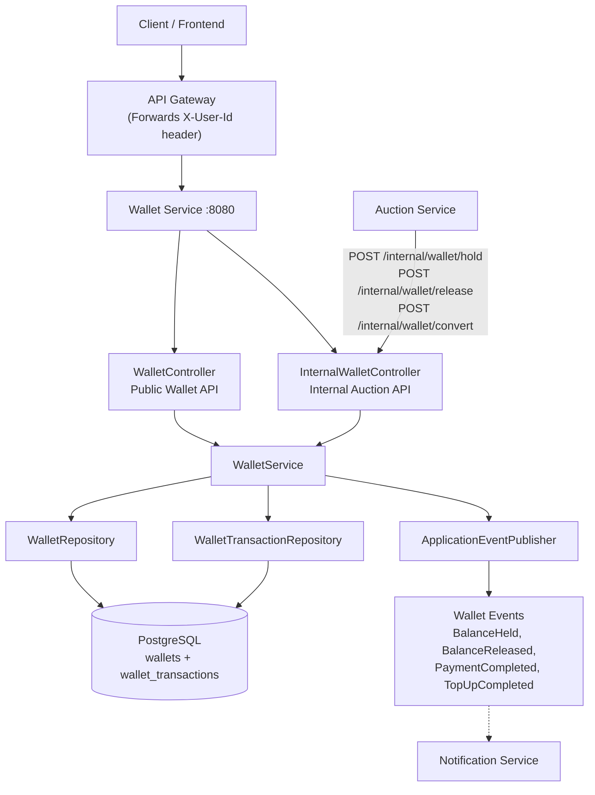
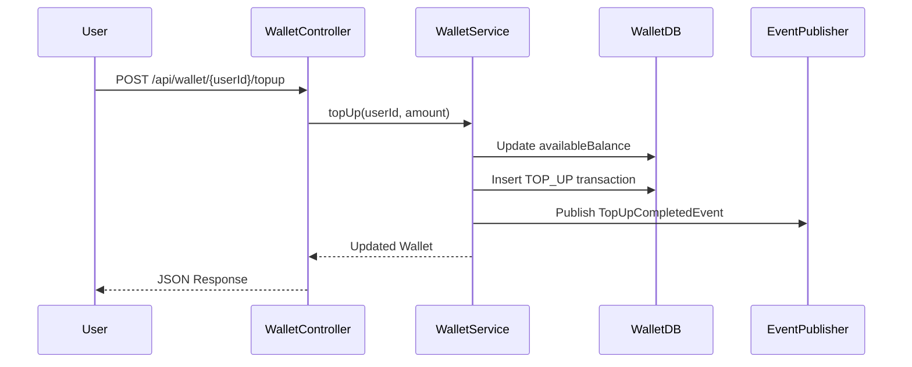
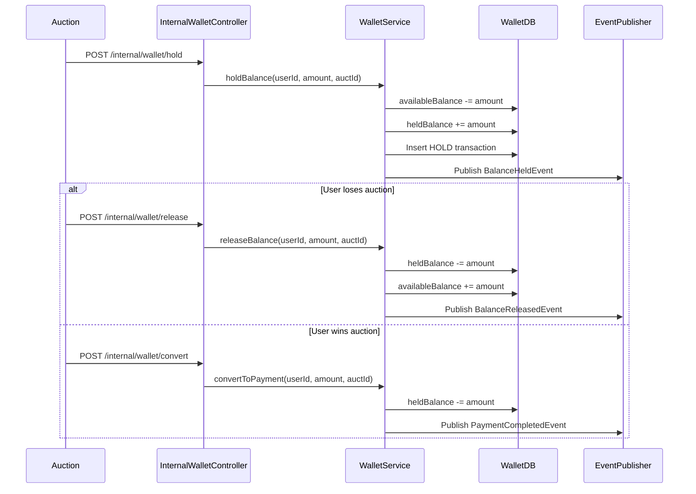

# BidMart Wallet Service

Wallet Service is the balance management microservice of the BidMart platform. It manages user wallet balance, top-up, withdrawal, held balance for active auction bids, payment conversion after winning an auction, transaction audit logs, and wallet-related events for notification or other services.

---

## Architecture Overview



---

## Key Design Decisions

| Concern | Solution |
|---|---|
| Balance Consistency | Wallet operations use `@Transactional` so balance updates and transaction logs are committed atomically |
| Negative Balance Prevention | Withdrawal, hold, release, and convert operations validate sufficient available or held balance |
| Auction Integration | Auction Service calls internal wallet endpoints for hold, release, and convert operations |
| Idempotency | Internal auction requests use `auctId` + `TransactionType` to prevent duplicate processing |
| Audit Trail | Every transaction stores `balanceBefore` and `balanceAfter` |
| Immutable Transaction Log | Wallet transactions are append-only and not exposed through update/delete APIs |
| Query Optimization | Indexes are added for frequently queried fields such as `user_id`, `wallet_id`, `auct_id`, `type`, and `created_at` |
| Transaction History Scalability | Transaction history uses pagination instead of returning all records at once |
| Event Publishing | Wallet publishes events such as `BalanceHeldEvent`, `BalanceReleasedEvent`, `PaymentCompletedEvent`, and `TopUpCompletedEvent` |

---

## Tech Stack

| Layer | Technology |
|---|---|
| Language | Java 21 |
| Framework | Spring Boot 3.3.2 |
| Database | PostgreSQL |
| ORM | Spring Data JPA + Hibernate |
| Build Tool | Gradle |
| Testing | JUnit 5 + Mockito |
| Coverage | JaCoCo |
| Containerization | Docker |
| API Style | REST/JSON |
| Event Mechanism | Spring Application Events |

---

## Prerequisites

- JDK 21
- PostgreSQL
- Gradle 8+ or included Gradle wrapper
- Docker, optional for containerized deployment
- Postman or similar API testing tool

---

## Local Setup

### 1. Clone the Repository

```bash
git clone https://github.com/advprog-2026-B15-project/bidmart-wallet.git
cd bidmart-wallet
```

---

### 2. Configure PostgreSQL

Create the database:

```sql
CREATE DATABASE bidmart_wallet;
```

Example local configuration in `src/main/resources/application.properties`:

```properties
spring.application.name=wallet

spring.datasource.url=jdbc:postgresql://localhost:5432/bidmart_wallet
spring.datasource.username=postgres
spring.datasource.password=your_password
spring.datasource.driver-class-name=org.postgresql.Driver

spring.jpa.hibernate.ddl-auto=update
spring.jpa.show-sql=true

spring.flyway.enabled=false
```

For deployment, use environment variables instead of hardcoding credentials:

```properties
spring.datasource.url=${DB_URL}
spring.datasource.username=${DB_USERNAME}
spring.datasource.password=${DB_PASSWORD}
```

---

### 3. Run the Application

```bash
./gradlew bootRun
```

On Windows:

```bash
.\gradlew.bat bootRun
```

The application will start on:

```text
http://localhost:8080
```

---

## API Reference

All wallet endpoints use JSON request and response bodies.

---

## Public Wallet Endpoints

| Method | Endpoint | Description |
|---|---|---|
| GET | `/api/wallet/{userId}` | Get wallet balance for a user |
| POST | `/api/wallet/{userId}/topup` | Add balance to wallet |
| POST | `/api/wallet/{userId}/withdraw` | Withdraw available balance |
| GET | `/api/wallet/{userId}/transactions?page=0&size=10` | Get paginated transaction history |

---

### GET `/api/wallet/{userId}`

Returns the user's wallet balance.

Example response:

```json
{
  "id": "wallet-001",
  "userId": "usr-3001",
  "availableBalance": 150000.00,
  "heldBalance": 50000.00
}
```

---

### POST `/api/wallet/{userId}/topup`

Adds balance to the user's wallet.

Request body:

```json
{
  "amount": 100000
}
```

Expected behavior:

```text
availableBalance increases
transaction log is created
TopUpCompletedEvent is published
```

---

### POST `/api/wallet/{userId}/withdraw`

Withdraws from available balance.

Request body:

```json
{
  "amount": 50000
}
```

Expected behavior:

```text
availableBalance decreases
transaction log is created
request fails if available balance is insufficient
```

---

### GET `/api/wallet/{userId}/transactions`

Returns paginated transaction history.

Example request:

```text
GET /api/wallet/usr-3001/transactions?page=0&size=10
```

Example response:

```json
{
  "content": [
    {
      "id": "tx-001",
      "walletId": "wallet-001",
      "type": "TOP_UP",
      "amount": 100000,
      "auctId": null,
      "balanceBefore": 0,
      "balanceAfter": 100000,
      "createdAt": "2026-04-17T10:00:00"
    }
  ],
  "totalPages": 1,
  "totalElements": 1,
  "size": 10,
  "number": 0
}
```

---

## Internal Wallet Endpoints

Internal endpoints are intended to be called by the Auction Service, not directly by users.

| Method | Endpoint | Description |
|---|---|---|
| POST | `/internal/wallet/hold` | Hold user balance before accepting a bid |
| POST | `/internal/wallet/release` | Release held balance when user loses auction |
| POST | `/internal/wallet/convert` | Convert held balance into final payment when user wins auction |

---

### POST `/internal/wallet/hold`

Called by Auction Service before accepting a bid.

Request body:

```json
{
  "userId": "usr-3001",
  "amount": 50000,
  "auctId": "auction-123"
}
```

Expected behavior:

```text
availableBalance decreases
heldBalance increases
HOLD transaction is recorded
BalanceHeldEvent is published
duplicate HOLD with same auctId is ignored
```

---

### POST `/internal/wallet/release`

Called by Auction Service when a user loses an auction.

Request body:

```json
{
  "userId": "usr-3001",
  "amount": 50000,
  "auctId": "auction-123"
}
```

Expected behavior:

```text
heldBalance decreases
availableBalance increases
RELEASE transaction is recorded
BalanceReleasedEvent is published
duplicate RELEASE with same auctId is ignored
```

---

### POST `/internal/wallet/convert`

Called by Auction Service when a user wins an auction.

Request body:

```json
{
  "userId": "usr-3001",
  "amount": 50000,
  "auctId": "auction-123"
}
```

Expected behavior:

```text
heldBalance decreases permanently
PAYMENT transaction is recorded
PaymentCompletedEvent is published
duplicate PAYMENT with same auctId is ignored
```

---

## Error Response Format

Example error response:

```json
{
  "code": "BAD_REQUEST",
  "message": "Insufficient balance"
}
```

Common errors:

| Condition | Error |
|---|---|
| Amount is zero, negative, or null | `Amount must be greater than zero` |
| Withdraw exceeds available balance | `Insufficient balance` |
| Hold exceeds available balance | `Insufficient balance` |
| Release exceeds held balance | `Insufficient held balance` |
| Convert exceeds held balance | `Insufficient held balance` |

---

## Wallet Flow

### Top Up Flow



---

### Auction Hold / Release / Convert Flow



---

## Database Tables

### `wallets`

| Column | Type | Description |
|---|---|---|
| id | VARCHAR / UUID | Wallet primary key |
| user_id | VARCHAR | Owner user ID |
| available_balance | NUMERIC | Balance available for withdrawal or bidding |
| held_balance | NUMERIC | Balance currently held for active bids |
| created_at | TIMESTAMP | Creation timestamp |
| updated_at | TIMESTAMP | Last update timestamp |

---

### `wallet_transactions`

| Column | Type | Description |
|---|---|---|
| id | VARCHAR / UUID | Transaction primary key |
| wallet_id | VARCHAR / UUID | Related wallet ID |
| type | VARCHAR | Transaction type |
| amount | NUMERIC | Transaction amount |
| auct_id | VARCHAR | Auction reference ID |
| balance_before | NUMERIC | Balance before transaction |
| balance_after | NUMERIC | Balance after transaction |
| created_at | TIMESTAMP | Transaction timestamp |

---

## Transaction Types

```text
TOP_UP
WITHDRAW
HOLD
RELEASE
PAYMENT
```

---

## Event Publishing

Wallet Service publishes the following events:

| Event | Trigger |
|---|---|
| `TopUpCompletedEvent` | User successfully tops up wallet |
| `BalanceHeldEvent` | Auction successfully holds bidder balance |
| `BalanceReleasedEvent` | Held balance is released after losing auction |
| `PaymentCompletedEvent` | Held balance is converted to payment after winning auction |

Current implementation uses Spring Application Events. For production microservice communication, this can be extended to RabbitMQ or another message broker so Notification Service can consume wallet events asynchronously.

---

## Running Tests

Run all tests:

```bash
./gradlew clean test
```

On Windows:

```bash
.\gradlew.bat clean test
```

Run with coverage report:

```bash
./gradlew clean test jacocoTestReport
```

On Windows:

```bash
.\gradlew.bat clean test jacocoTestReport
```

Open coverage report:

```text
build/reports/jacoco/test/html/index.html
```

---

## CI/CD

The project uses Gradle tasks for testing and coverage verification.

Recommended pipeline flow:

```text
checkout repository
setup JDK 21
run ./gradlew clean test
run ./gradlew jacocoTestReport
run ./gradlew jacocoTestCoverageVerification
build Docker image
deploy to AWS EC2
```

---

## Docker

Build the Docker image:

```bash
docker build -t bidmart-wallet .
```

Run the container:

```bash
docker run -p 8080:8080 ^
  -e DB_URL=jdbc:postgresql://host.docker.internal:5432/bidmart_wallet ^
  -e DB_USERNAME=postgres ^
  -e DB_PASSWORD=your_password ^
  bidmart-wallet
```

For Linux/macOS:

```bash
docker run -p 8080:8080 \
  -e DB_URL=jdbc:postgresql://host.docker.internal:5432/bidmart_wallet \
  -e DB_USERNAME=postgres \
  -e DB_PASSWORD=your_password \
  bidmart-wallet
```

---

## Deployment Notes

Wallet Service is designed to be deployed as an independent microservice.


In the full BidMart architecture:

```text
Frontend / API Gateway -> Wallet Service
Auction Service -> Wallet Service internal API
Wallet Service -> Event Broker / Notification Service
```

---

## Security Hardening

Implemented or planned hardening:

- Amount validation rejects null, zero, and negative values
- Available balance cannot become negative
- Held balance cannot become negative
- Internal Auction operations are idempotent
- Transaction logs are immutable
- Database credentials should be supplied through environment variables
- Public and internal APIs are separated
- Future production setup should secure internal endpoints through API Gateway or service-to-service authentication
